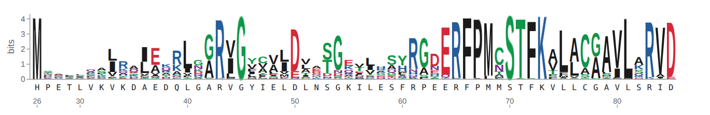
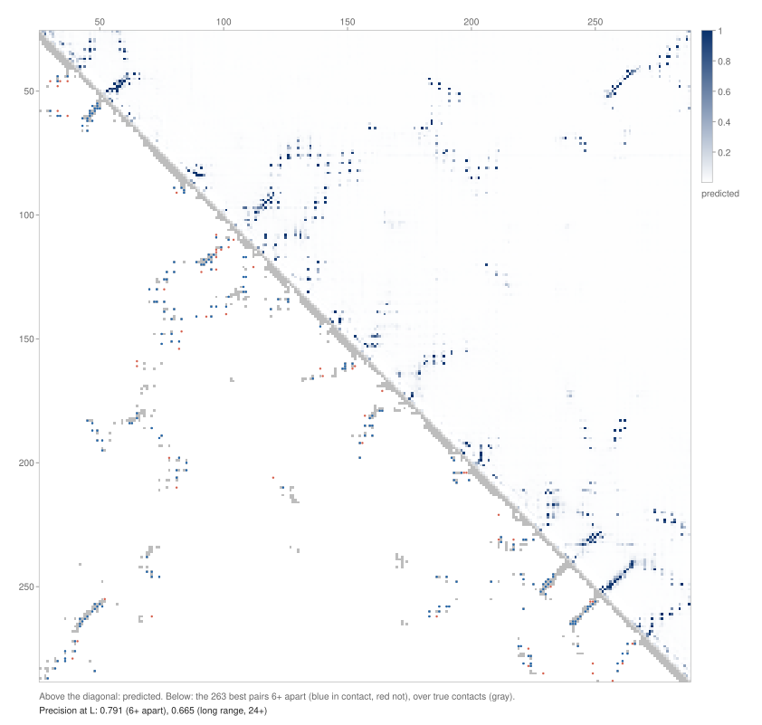
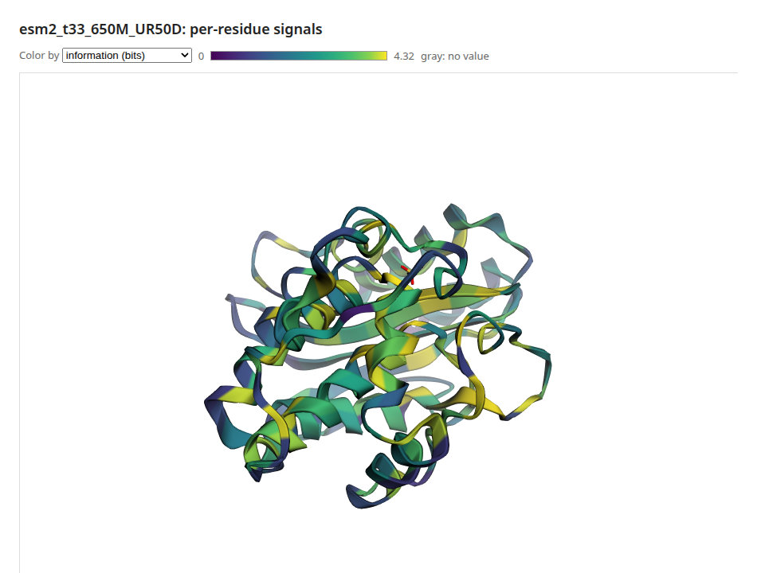

# Protein Language Models

A protein language model reads an amino-acid sequence the way a text model reads words. ESM-2,
the model family pulsatrix runs, was trained by hiding residues and predicting them. Along the
way it learned which positions tolerate change, which residues touch in the folded protein, and
which motifs mark functional sites. pulsatrix loads the published ESM-2 checkpoints natively in
C++, on CPU or GPU, with no Python. You can run them, read their internal representations,
train them further and explain their predictions.

It scores mutations zero-shot and reproduces ProteinGym's published ESM-2 numbers. It predicts
which residues touch from the model's attention and checks them against experimental
structures, draws all of it the way biologists read it (mutation maps, sequence logos,
contact maps, residue tracks and the 3D structure), and explains its predictions residue by
residue, with checks on those explanations. Training comes next (see the
[roadmap](../roadmap/index.md#plm-protein-language-models) and the
[research and plan](../roadmap/protein-language-models.md)).

## What's inside

- **`EncoderLM`** (`encoder_lm.hpp`): an ESM-2 masked language model. It has:
  - token embeddings with ESM's token-dropout scaling;
  - pre-LayerNorm encoder layers with rotary attention (`EncoderBlock`);
  - a final LayerNorm;
  - the LM head, which maps each position to scores for all 33 tokens.
- **`LoadEncoderLM(directory, backend)`**: loads a Hugging Face ESM-2 directory (`config.json`
  plus safetensors), such as
  [`facebook/esm2_t6_8M_UR50D`](https://huggingface.co/facebook/esm2_t6_8M_UR50D) up to
  `esm2_t33_650M_UR50D`. ESM-2 is MIT-licensed.
- **`LoadEsmTokenizer(vocab.txt)`**: ESM's tokenizer. Each residue is a token, `<mask>` hides
  one, and `<cls>` and `<eos>` mark the ends.
- **`ReadFasta` / `ParseFasta` / `WriteFasta`**: FASTA files, with multi-line sequences,
  comments and Windows line endings.

| Checkpoint | Layers | Width | Parameters | Size |
|---|---|---|---|---|
| `esm2_t6_8M_UR50D` | 6 | 320 | 8M | 31 MB |
| `esm2_t12_35M_UR50D` | 12 | 480 | 35M | 140 MB |
| `esm2_t30_150M_UR50D` | 30 | 640 | 150M | 600 MB |
| `esm2_t33_650M_UR50D` | 33 | 1280 | 650M | 2.6 GB |

## Predicting a hidden residue

```cpp
#include "pulsatrix/cpu_backend.hpp"
#include "pulsatrix/encoder_lm.hpp"
#include "pulsatrix/protein_sequences.hpp"

using namespace pulsatrix;

CPUBackend backend;
auto model = LoadEncoderLM("esm2_t33_650M_UR50D", &backend);
TextTokenizer tok = LoadEsmTokenizer("esm2_t33_650M_UR50D/vocab.txt");

// Ubiquitin with residue 11 (a lysine) hidden.
Encoding e = tok.encode("MQIFVKTLTG<mask>TITLEVEPSDTIENVKAKIQDKEGIPPDQQRLIFAGKQLEDGRTLSDYNIQKESTLHLVLRLRGG");
std::vector<float> ids(e.ids.begin(), e.ids.end());
Tensor logits = model->forward(Tensor(Shape({1, (int64_t)ids.size()}), &backend, ids));
// logits is (1, L, 33). Position 0 is <cls>, so residue 11 is position 11.
```

The 650M model puts lysine first, which is correct; the 8M model guesses glutamate. On a CPU,
the 650M model takes about 6 seconds to load and run.

Download a checkpoint with any Hugging Face client, or fetch three files directly:

```bash
for f in config.json model.safetensors vocab.txt; do
  curl -fsSL https://huggingface.co/facebook/esm2_t6_8M_UR50D/resolve/main/$f -o esm2_t6_8M_UR50D/$f
done
```

## Reading the model's representations

After `forward()`:

- **`last_hidden_state()`** is `(N, L, width)`: the per-residue representations usually called
  "ESM embeddings", taken after the final LayerNorm. Average over the residues, without `<cls>`
  and `<eos>`, for a per-protein vector.
- **`hidden_states()`** holds the embeddings, then every layer's output. Probes and sparse
  autoencoders read these. Early and middle layers often work better than the last.
- **`layer(i).mha().last_attention_weights()`** is `(N, heads, L, L)`, each layer's attention.
  Some heads track which residues touch in the structure (see [Predicting contacts](#predicting-contacts)).
  `set_attention_observer()` hands each layer's map to a callback during `forward()`, so all of
  them can be read even with `set_keep_activations(false)`.

**Batches of different lengths.** Pad each sequence with `<pad>` (id 1) and pass a mask:

```cpp
model->set_padding_mask(keep);  // (N, L): 1 for a real token, 0 for padding
Tensor logits = model->forward(ids);
```

Padding is kept out of attention and out of token dropout's count, as in Hugging Face's
`attention_mask`. `clear_padding_mask()` removes it.

## Details that matter for correctness

- **Token dropout.** ESM-2 was trained with masked residues' embeddings zeroed. To match, every
  embedding is scaled by `(1 - 0.12) / (1 - masked fraction)`, even when nothing is masked. Its
  outputs depend on this.
- **Stored RoPE frequencies.** The checkpoints store their rotary frequencies rounded to fp16
  (0.316162 rather than 0.316228). The model was trained with those values, and transformers
  uses them, so pulsatrix reads them from the checkpoint. Recomputing them exactly shifts every
  attention map by about 2e-4.
- **Checkpoint names.** Older checkpoints name LayerNorm parameters `weight`/`bias`;
  transformers 5 saves `gamma`/`beta`. Both load.
- **Tokenizer quirks**, kept for parity with `EsmTokenizer`:
  - whitespace is dropped;
  - lowercase and unknown letters aren't residues;
  - a run of them becomes a single `<unk>` (`mkta` is one token).

  Uppercase your sequences first.

## Scoring mutations

A deep mutational scan measures how thousands of single and multiple substitutions change a
protein's function. ESM-2 predicts those effects with no training on the protein: a substitution
scores `log p(mutant) - log p(wild type)` at its position, and a multiple mutant the sum of its
substitutions. Higher means the model finds the variant more plausible.

```cpp
#include "pulsatrix/variant_scoring.hpp"

VariantScorer scorer(*model, tok, &backend);
const std::string seq = "MQIFVKTLTGKTITLEVEPSDTIENVKAKIQDKEGIPPDQQRLIFAGKQLEDGRTLSDYNIQKESTLHLVLRLRGG";
ResidueLogProbs m = scorer.masked_marginals(seq);         // one masked pass per residue
double s = scorer.score(m, seq, ParseMutations("K11R:I44A"));
std::vector<float> scan = scorer.single_mutant_scan(m, seq);  // L x 20, every substitution
```

- **Masked marginals** (`masked_marginals`), ProteinGym's choice for ESM-2, mask each residue in
  turn: one forward pass per residue, however many variants there are.
- **Wild-type marginals** (`wild_type_marginals`) read the same log-ratios from one unmasked
  pass. They are much faster and somewhat less accurate.
- **Pseudo-log-likelihood** (`pseudo_log_likelihood`) sums `log p(residue)` with each residue
  masked: a score for a whole sequence.

Sequences longer than the model's 1024-token window are cut, for each masked position, to the
window ProteinGym's `get_optimal_window` picks around it.

### Memory

Scoring needs only the logits, so `VariantScorer` runs the model with
`EncoderLM::set_keep_activations(false)`: each layer frees the activations it would keep for
`backward()` and LRP as soon as its output is computed. A 1024-token ESM-2 650M pass otherwise
holds over 10 GB of them per sequence. `VariantScoringOptions::max_pass_bytes` (default 4 GiB)
bounds each pass by `ScoringPassBytes`: long windows run fewer per batch, and a pass that can't
fit even one sequence is refused instead of exhausting memory. Loading 650M itself peaks at about
10 GB on the host (roadmap FND-9), so on a 32 GB machine run it on the GPU, or watch the rest.

### ProteinGym

`tools/plm/pulsatrix_proteingym` runs ProteinGym's substitution benchmark and reports its five
metrics (Spearman, AUC, MCC, NDCG and top-10% recall, in `fitness_metrics.hpp`, checked against
scipy, scikit-learn and ProteinGym's own code), beside the published numbers if given:

```bash
pulsatrix_proteingym esm2_t33_650M_UR50D --device hip \
    --reference DMS_substitutions.csv --dms-dir DMS_ProteinGym_substitutions \
    --assays BLAT_ECOLX_Stiffler_2015,RL40A_YEAST_Roscoe_2013 \
    --published spearman_dms.csv --published-column "ESM2 (650M)" \
    --published-scores zero_shot_substitutions_scores --published-score-column ESM2_650M
```

On 14 assays with ESM-2 650M (gfx1151), pulsatrix matches ProteinGym's published Spearman to the
three decimals it reports. On the 13 shorter ones, compared variant by variant, every score is
within 9e-5 of ProteinGym's:

| Assay | Length | Variants | Spearman | Published | Seconds |
|---|---|---|---|---|---|
| BLAT_ECOLX_Stiffler_2015 | 286 | 4996 | 0.7315 | 0.731 | 65.8 |
| BRCA1_HUMAN_Findlay_2018 | 1863 | 1837 | 0.5149 | 0.515 | 6902 |
| CALM1_HUMAN_Weile_2017 | 149 | 1813 | 0.2116 | 0.212 | 16.6 |
| DNJA1_HUMAN_Tsuboyama_2023_2LO1 | 65 | 2264 | 0.8029 | 0.803 | 3.3 |
| EPHB2_HUMAN_Tsuboyama_2023_1F0M | 66 | 1960 | 0.8105 | 0.810 | 3.4 |
| PIN1_HUMAN_Tsuboyama_2023_1I6C | 39 | 802 | 0.6699 | 0.670 | 1.4 |
| PR40A_HUMAN_Tsuboyama_2023_1UZC | 63 | 2033 | 0.8047 | 0.805 | 3.2 |
| RASH_HUMAN_Bandaru_2017 | 189 | 3134 | 0.4976 | 0.498 | 27.5 |
| RL40A_YEAST_Roscoe_2013 | 128 | 1195 | 0.5986 | 0.599 | 12.4 |
| SQSTM_MOUSE_Tsuboyama_2023_2RRU | 40 | 707 | 0.6180 | 0.618 | 1.5 |
| SUMO1_HUMAN_Weile_2017 | 101 | 1700 | 0.5093 | 0.509 | 7.7 |
| TCRG1_MOUSE_Tsuboyama_2023_1E0L | 37 | 1058 | 0.7692 | 0.769 | 1.2 |
| TPMT_HUMAN_Matreyek_2018 | 245 | 3648 | 0.5387 | 0.539 | 47.9 |
| UBC9_HUMAN_Weile_2017 | 159 | 2563 | 0.4726 | 0.473 | 19.5 |

BRCA1 is the one assay longer than the window; its two hours are what roadmap HIP-13 is for.

## Predicting contacts

Two residues are in contact when they sit within 8 Å in the folded protein. ESM-2 was never
shown a structure, yet some of its attention heads point at contacts. ESM's contact head reads
them out (`protein_contacts.hpp`):

1. Each head's attention map over the residues is made symmetric (`A + Aᵀ`).
2. The average product correction (APC), `F - rowsum * colsum / total`, removes what every
   residue attends to regardless of partner.
3. A logistic regression over every head's corrected map, trained by ESM's authors on a few
   structures and shipped in the checkpoint, gives a probability per residue pair.

```cpp
#include "pulsatrix/protein_contacts.hpp"

EsmContactHead head = LoadEsmContactHead("esm2_t33_650M_UR50D", model->config());
ContactPredictor predictor(*model, tok, &backend);
ContactMap p = predictor.predict(seq, head);  // L x L contact probabilities

ProteinStructure s = ReadStructure("1UBQ.cif");  // or .pdb
const StructureChain& chain = s.chain("A");
ContactMap truth = TrueContacts(chain);  // Cβ (Cα for glycine) under 8 Å
ContactEvaluation e = EvaluateContacts(predictor.predict(chain.sequence(), head), truth);
// e.long_range.at_l: of the L best-scored pairs at least 24 residues apart, the fraction in contact
```

- **One pass, one layer at a time.** The prediction is a single forward pass over `<cls>` + the
  sequence + `<eos>`. Each layer's attention is folded into the result as soon as the layer
  finishes and is then freed, so memory doesn't grow with the number of layers.
  `ContactOptions::max_pass_bytes` bounds the pass as it does for scoring.
- **Heads instead of a regression.** `average_heads(seq, heads)` averages chosen heads' corrected
  maps. `RankContactHeads` orders every head by its long-range precision at L on proteins with
  known structures. A 2026 paper (arXiv 2606.21876) reports that the best few heads, chosen on
  10 proteins, do as well as more expensive methods. `for_each_head` streams every head's map,
  for a head grid.
- **Precision at L.** `ContactPrecision` takes the top-scored pairs `i < j` within a separation
  range (CASP's short 6–11, medium 12–23 and long 24+) and counts how many are true contacts.
  Pairs with an unknown distance don't compete. `PrecisionAtL` uses the top L, L/2 and L/5,
  L being the sequence length. Where there are fewer pairs than the count, the missing ones count
  as wrong, as in ESM's own `compute_precisions`.

### Structures

`ReadStructure` reads PDB and mmCIF files (`ParsePdb`, `ParseMmcif` for text), such as
`https://files.rcsb.org/download/1UBQ.cif` or AlphaFold DB models. It keeps the first model's
protein chains, with the author's chain ids and residue numbers in both formats:

- `ATOM` records, and selenomethionine (`MSE`, read as M) from `HETATM`;
- residues that have a Cα, so waters, ligands and nucleic acids drop out;
- the first of each atom's alternate locations.

`StructureChain::sequence()` is the observed sequence: residues missing from the file are
missing from it too, so predict on that sequence when you compare. `ResidueDistances` measures
Cβ (Cα for glycine), Cα, or a virtual Cβ placed from the backbone, as ESM's example and
trRosetta do. A residue missing the atoms it needs gives NaN, which the precision skips.

### Results

`tools/plm/pulsatrix_contacts` predicts and scores contacts for a list of structures. With
`--choose-heads`, it also ranks the heads on other proteins and scores the average of the best
K:

```bash
pulsatrix_contacts esm2_t33_650M_UR50D --structures structures \
    --proteins 1UBQ:A,2LZM:A,1BTL:A,4AKE:A,2PTN:A \
    --choose-heads 1PGA:A,1CRN:A,1A3N:A,3P0G:B,5P21:A --top-k 10
```

Long-range precision with ESM-2 650M. Its ten heads were chosen on five other proteins; all are
famous structures the model has likely seen sequences of, so expect lower numbers on new folds.

| Protein | Length | P@L | P@L/2 | P@L/5 | Top-10 heads P@L | Top-10 heads P@L/5 |
|---|---|---|---|---|---|---|
| Ubiquitin (1UBQ) | 76 | 0.645 | 0.895 | 1.000 | 0.632 | 0.933 |
| T4 lysozyme (2LZM) | 164 | 0.463 | 0.683 | 0.875 | 0.470 | 0.844 |
| TEM-1 β-lactamase (1BTL) | 263 | 0.665 | 0.824 | 0.923 | 0.681 | 0.904 |
| Adenylate kinase (4AKE) | 214 | 0.696 | 0.869 | 0.976 | 0.668 | 0.905 |
| Trypsin (2PTN) | 223 | 0.717 | 0.838 | 0.977 | 0.758 | 1.000 |
| Mean | | 0.637 | 0.822 | 0.950 | 0.642 | 0.917 |

The ten heads sit in layers 22 to 32 of 33 and match the trained head without any regression.
ESM-2 8M reaches a mean long-range P@L of only 0.12 on the same proteins.

**Checked against transformers and biotite.** `tools/golden/make_contact_golden.py` records
transformers' `predict_contacts`, the precision by both pulsatrix's definition and ESM's
`compute_precisions`, and biotite's reading of every structure. On ten proteins, pulsatrix's
predicted probabilities are within 3.1e-5 of transformers' with ESM-2 8M and 650M, and the
precisions are equal. Both formats of all 17 chains in 13 entries give the same sequences as
biotite, and distances within 1e-4 Å. CI runs the same checks on the tiny ESM-2 and on crambin
(`tests/fixtures/structures`).

## Protein views

`viz/protein_documents.hpp` turns the model's outputs into four
[viz documents](../visualization/index.md#json-documents), and `viz/protein_views.hpp` draws
them. Each is an SVG figure (for papers and CI: no fonts, GPU or browser needed) or an HTML page
holding that figure, whose cells show their values on hover. The pages have no scripts, so they
work offline.

| Document | Built by | Shows |
|---|---|---|
| `MutationMapDocument` | `MakeMutationMapDocument(seq, scorer.single_mutant_scan(m, seq))` | Every substitution's score, a row per amino acid and a column per residue, the wild type dotted |
| `SequenceLogoDocument` | `MakeSequenceLogoDocument(m, tok, seq)` | What the model expects at each residue: letters stacked to the position's information content, colored by chemistry |
| `ContactMapDocument` | `MakeContactMapDocument(seq, predicted, &truth)` | Predicted contacts above the diagonal; below, the structure's contacts in gray and the L best predictions as dots, blue if right and red if wrong, with the precision |
| `ResidueTracksDocument` | Any per-residue values, plus annotated stretches | Tracks stacked under the sequence: `MeanSubstitutionScore` (how much the model minds a change), `InformationContent`, or your own |

```cpp
#include "pulsatrix/viz/protein_views.hpp"

ResidueLogProbs m = scorer.masked_marginals(seq);
MutationMapDocument scan = MakeMutationMapDocument(seq, scorer.single_mutant_scan(m, seq), "masked_marginals");
std::ofstream("scan.svg") << RenderMutationMapSvg(scan);
std::ofstream("logo.html") << RenderSequenceLogoHtml(MakeSequenceLogoDocument(m, tok, seq));

ResidueTracksDocument tracks;
tracks.sequence = seq;
tracks.tracks.push_back({"mean substitution score", MeanSubstitutionScore(scan), /*signed=*/true});
tracks.features.push_back({"catalytic motif", 70, 73, "site"});
std::ofstream("tracks.svg") << RenderResidueTracksSvg(tracks);
```

ESM-2 650M on TEM-1 β-lactamase (1BTL): the logo of its first 60 residues. The catalytic
serine's motif, S70-T-F-K73, is the most conserved stretch.



Its contact map against the crystal structure: 66% of the top L long-range predictions are right.



### The structure in 3D

`RenderStructureHtml(structure_text, chain, tracks)` draws a PDB or mmCIF file with
[3Dmol.js](https://3dmol.csb.pitt.edu/) and colors the chain by any track, with a menu to switch
tracks. Hovering a residue shows its value. Residues are matched by `residue_ids` (author number
plus insertion code, `ResidueIds(chain)` gives them), or one for one when the chain's sequence is
the tracks' sequence. 3Dmol.js 2.5.5 loads from jsDelivr, pinned and checked by its hash, or is
copied into the page with `HtmlScripts::Inline` (`tools/render/fetch_vega.sh` downloads it).



### From the command line

`tools/plm/pulsatrix_protein_views` runs all of it for one protein, from a sequence or a
structure, and writes each document as JSON, SVG and HTML, plus the structure page:

```bash
pulsatrix_protein_views esm2_t33_650M_UR50D --structure 1BTL.cif --chain A --out tem1/ --device hip
```

For TEM-1 with 650M on gfx1151, that takes a minute, most of it the masked marginals (one pass per
residue). `pulsatrix_svg` draws any saved document again: `pulsatrix_svg tem1/contact_map.v1.json
-o contacts.svg`.

Positions are numbered from the document's `first_position`, one per residue. A structure whose
author numbering skips numbers (TEM-1's Ambler numbering skips 239 and 253) is numbered
consecutively in the figures; the structure page uses the real ids.

## Training and explaining

`EncoderLM` is an ordinary `Module`, so the rest of the library applies:

- `backward()` gives gradients for every parameter, and `set_requires_grad` freezes parts for
  fine-tuning.
- `TokenCrossEntropyLoss` with ignore-index -100 is the masked-LM loss.
- `propagate_relevance()` explains a logit with LRP and returns relevance per input token.
  `propagate_relevance_by_layer()` stops at every layer, which is what attribution graphs use;
  `propagate_hidden_relevance_by_layer()` starts from the representations, for your own head.
- The masking step for masked-LM training and fine-tuning heads are roadmap item PLM-7.

## Explaining residue by residue

`EncoderExplainer` (`protein_explanations.hpp`) runs AttnLRP from one of four targets back to
the input residues:

| Target | Explains |
|---|---|
| `EncoderTarget::MaskedToken(i, 'L')` | The logit of L at residue i, with i masked |
| `EncoderTarget::ForMutation(ParseMutations("K48F")[0])` | The mutation's log-odds, `logit(F) - logit(K)` at the masked residue: its masked-marginal score |
| `EncoderTarget::ProteinHead(head)` | A linear head on the mean of the residues' representations (a per-protein regression or probe) |
| `EncoderTarget::ResidueHead(head, i)` | A linear head on residue i's representation |

```cpp
#include "pulsatrix/protein_explanations.hpp"

EncoderExplainer explainer(*model, tok, &backend);
ResidueRelevance r = explainer.explain(seq, EncoderTarget::ForMutation(ParseMutations("K48F")[0]));
// r.residues: one value per residue; r.layers: per token after every layer; r.value: the log-odds
AttributionGraph g = explainer.relevance_graph(seq, target, options);  // for Neuronpedia's viewer
```

**It matches LXT.** `LxtAttnLrpConfig()` applies AttnLRP's rules as LXT does: the identity rule
on GELU, the uniform rule at attention's matmuls, the epsilon rule elsewhere, and LayerNorm with
only its standard deviation held constant. LXT has no ESM patch, so
`tools/golden/make_esm_attnlrp_reference.py` applies those rules to transformers' ESM-2 the way
LXT's BERT patch does. On all four targets, for every token and after every layer:

| Model | Worst difference (relative to the largest relevance) | Lowest correlation |
|---|---|---|
| Tiny random ESM-2 (CI) | under 1e-4 | 1.0000 |
| ESM-2 8M | 1.5e-4 | 1.000000 |
| ESM-2 650M | 4.8e-5 | 1.000000 |

Plain gradient × input, the negative control, misses by more than 5%.

### The checks

A residue map can look plausible and still not explain the model: a 2026 study found integrated
gradients on a well-performing ESM-2 classifier didn't recover annotated epitopes. So
explanations come with checks against something independent of how they look:

- **`DeletionCheck`.** It masks residues in the order they support the value, and compares
  that with random orders. A faithful explanation moves the value toward zero faster.
- **`RandomizationCheck`** (Adebayo et al. 2018). It randomizes the weight matrices from the LM
  head down, layer by layer, and re-explains. An explanation that stays the same isn't
  explaining the model.
- **`CompareResidueSignals`.** It compares a per-residue explanation with an independent signal:
  - `DmsPositionSensitivity`, how much a deep mutational scan's single mutants hurt at each
    residue;
  - `AlignmentConservation`, from an A2M alignment such as ProteinGym's.
- **`RelevanceProfile`.** It turns explanations into a per-protein signal to compare: how much
  the model draws on each residue when predicting the others. That's one explanation per
  residue.

`tools/plm/pulsatrix_explain_protein` runs all of them:

```bash
pulsatrix_explain_protein esm2_t33_650M_UR50D --assay BLAT_ECOLX_Stiffler_2015 \
    --reference DMS_substitutions.csv --dms-dir DMS_ProteinGym_substitutions \
    --msa BLAT_ECOLX_full_11-26-2021_b02.a2m --profile --out tem1/ --device hip
```

ESM-2 650M on gfx1151, explaining each assay's most damaging single mutant:

| | Ubiquitin (RL40A_YEAST, K48F) | TEM-1 (BLAT_ECOLX, K71S) |
|---|---|---|
| Deletion: value left (area), relevant first vs random | 3.81 vs 5.23: faithful | 3.27 vs 5.23: faithful |
| Randomization: similarity after the LM head; after the top 14 layers (32 to 19) | 0.25; 0.08 | 0.67; 0.83 |
| Profile vs DMS sensitivity: Spearman (top-10% overlap, chance) | 0.04 (0.29, 0.09) | 0.08 (0.19, 0.10) |
| Profile vs conservation | 0.03 (0.00, 0.09) | 0.10 (0.38, 0.10) |
| Conservation vs DMS sensitivity, for scale | 0.29 | 0.50 |

What this says:

- **Deletion.** Both explanations rank residues by how much the prediction needs them.
- **Randomization.** Ubiquitin's explanation depends on the whole model. TEM-1's doesn't: its
  residue ranking survives randomizing the top 14 layers and only drops (to 0.16) once layer 18
  is randomized too.
  So most of what that map shows comes from the lower layers.
- **Agreement.** Neither protein's relevance profile matches the functional signals: what the
  model draws on to predict residues isn't where mutations hurt or where the family is
  conserved. Read relevance maps as what the model uses, not as maps of function.

The run takes 2 minutes for ubiquitin (128 residues) and 6 for TEM-1 (286), most of it the
profile.

## Checking against Hugging Face

`tools/golden/make_esm_golden.py` records transformers' outputs for a model:
- logits;
- every layer's hidden state;
- every attention map;
- a padded batch;
- the tokenizer's ids on edge cases.

`tests/encoder_lm_test.cpp` compares pulsatrix with them. CI runs it on a tiny random ESM-2
(`tests/fixtures/hf_tiny/esm`). Setting `PULSATRIX_GOLDEN_DIR` to a directory of downloaded
models checks those too. Worst differences on the real checkpoints (transformers 5.18, float32):

| Model | Hidden states (relative) | Attention (absolute) | Logits (relative) |
|---|---|---|---|
| ESM-2 8M | 2.8e-6 | 4.4e-6 | 2.7e-6 |
| ESM-2 650M | 3.7e-6 | 1.3e-5 | 3.6e-6 |

That is float32 precision: transformers' own float32 run differs from float64 by about 3e-6 in
attention. The tokenizer matches `EsmTokenizer` on every case recorded.
