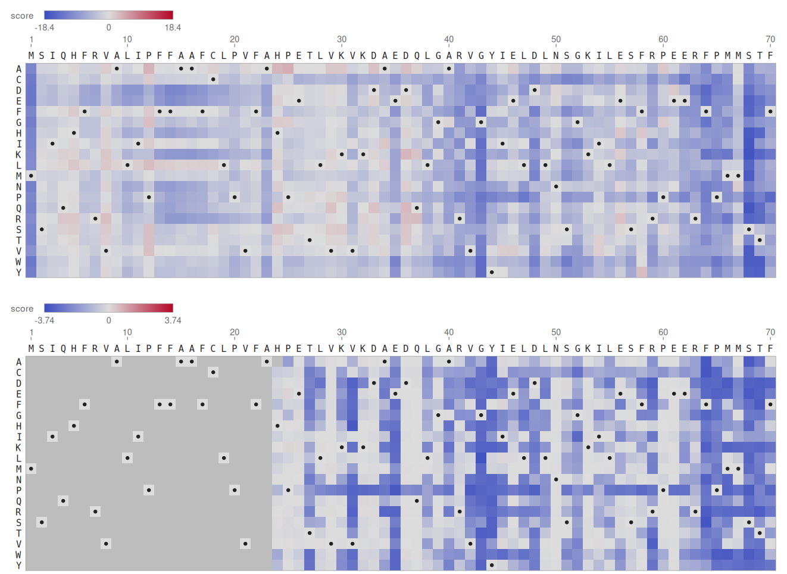
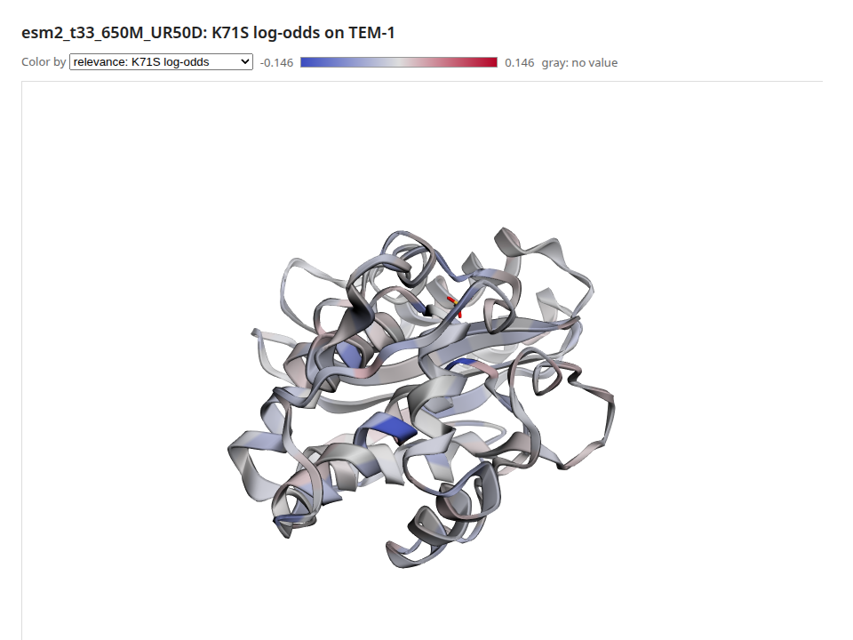

# Recipe: One Protein End to End (TEM-1 β-Lactamase)

**What you'll build:** the whole protein path on one enzyme, TEM-1 β-lactamase, the enzyme that
makes *E. coli* resistant to ampicillin. ESM-2 has never seen a measurement of it, yet:

1. It scores all 4,996 single mutants of a deep mutational scan (Stiffler et al. 2015). Their
   correlation with the measured resistance is reported, and the model's mutation map is drawn
   beside the measured one.
2. It predicts which residues touch from its attention, checked against the crystal structure
   (PDB 1BTL).
3. It explains the most damaging mutation residue by residue. A deletion check tests the
   explanation, and the result is shown on the 3D structure.

CMake target: `protein_tem1_recipe` (`examples/recipes/protein_tem1.cpp`).

```bash
./build/protein_tem1_recipe MODEL_DIR PROTEINGYM_DIR 1BTL.cif out/ [--device hip]
```

!!! note
    The recipe needs three downloads (about 1 GB in all, mostly the ProteinGym assays):

    - An ESM-2 checkpoint, such as
      [`facebook/esm2_t33_650M_UR50D`](https://huggingface.co/facebook/esm2_t33_650M_UR50D)
      (2.6 GB, see [Protein language models](../../protein-models/index.md)), or `esm2_t6_8M_UR50D`
      (31 MB) to try it on a CPU.
    - ProteinGym's `DMS_substitutions.csv` and `DMS_ProteinGym_substitutions/` from
      [proteingym.org](https://proteingym.org).
    - `https://files.rcsb.org/download/1BTL.cif`.

    With 650M the recipe takes 82 seconds on an AMD gfx1151 GPU. With 8M it takes a minute on a
    CPU.

## Code

```cpp
// 1. Every mutation, zero-shot: one masked pass per residue.
VariantScorer scorer(*model, tok, backend);
const ResidueLogProbs marginals = scorer.masked_marginals(seq);
double s = scorer.score(marginals, seq, ParseMutations("K71S"));       // log p(S) - log p(K)
MutationMapDocument map = MakeMutationMapDocument(seq, scorer.single_mutant_scan(marginals, seq));
std::ofstream("map.svg") << RenderMutationMapSvg(map);

// 2. Contacts from attention, against the structure.
const StructureChain chain = ReadStructure("1BTL.cif").chain("A");
ContactPredictor predictor(*model, tok, backend);
const ContactMap p = predictor.predict(chain.sequence(), LoadEsmContactHead(model_dir, model->config()));
ContactEvaluation e = EvaluateContacts(p, TrueContacts(chain));         // precision at L, L/2, L/5

// 3. Explain a mutation, check the explanation, and paint it on the structure.
EncoderExplainer explainer(*model, tok, backend);
const EncoderTarget target = EncoderTarget::ForMutation(ParseMutations("K71S")[0]);
const ResidueRelevance r = explainer.explain(seq, target);
const ResidueDeletionCurve d = DeletionCheck(explainer, seq, target, r.residues);
ResidueTracksDocument tracks;  // the relevance, measured sensitivity and the model's own scores
// ... tracks.residue_ids = ResidueIds(chain), so values land on the structure's residues ...
std::ofstream("structure.html") << RenderStructureHtml(cif_text, "A", tracks);
```

Full source:
[`examples/recipes/protein_tem1.cpp`](https://github.com/Joshuaweg/pulsatrix/blob/master/examples/recipes/protein_tem1.cpp).

## Expected output

With ESM-2 650M on the GPU:

```
BLAT_ECOLX_Stiffler_2015: 286 residues, 4996 measured variants; model esm2_t33_650M_UR50D

1. Scoring every mutation
  Spearman with the measured fitness: 0.7315 over 4996 variants

2. Contacts against 1BTL.cif
  chain A: 263 residues, precursor positions 24 to 286; V84I A184V in the crystal
  long-range precision: P@L 0.665, P@L/2 0.824, P@L/5 0.923

3. Explaining K71S (Ambler K73S), the most damaging mutation measured
  log-odds -12.308; most relevant residues (Ambler): S70 -0.146 L76 -0.132 Y46 -0.090 S130 -0.085
    C123 -0.080 S59 -0.077 G87 -0.076 S53 -0.076
  deletion check: area 3.711, against 5.458 for random orders (faithful)
```

It also writes `mutation_map_model.svg`, `mutation_map_measured.svg`, `contact_map.svg`,
`residue_tracks.svg` and `structure.html` into the output directory. With ESM-2 8M the numbers
are lower but the story holds:

- the scan's Spearman is 0.40 and the contacts' P@L 0.05;
- K73S's explanation is still led by S70;
- the deletion check is still faithful.

The model's map (top) and the measurements (bottom), residues 1 to 70. Blue is damaging, and
the dots mark the wild type. The signal peptide (1–23) wasn't measured.



The explanation of K73S on the structure. Blue residues pull the log-odds down, toward "this
mutation is bad".



## What's happening

**Zero-shot fitness.** The model has only learned which residues proteins tend to have where.
A substitution scores `log p(mutant) - log p(wild type)` with that residue masked. Its 0.73
correlation with measured ampicillin resistance is ProteinGym's published ESM-2 650M number for
this assay. The maps agree where it matters: whole columns of blue mark residues that tolerate no
change, around the catalytic S70 (sequence position 68) and K73 for example.

**Two numberings.** The scan numbers the 286-residue precursor from 1. The crystal structure uses
Ambler's numbering for class A β-lactamases: the mature protein starts at 26, and 239 and 253
are skipped. The recipe places the structure's 263 residues in the precursor. It finds the
ungapped placement with the most identical residues, which shows the crystal's two variants
(V84I, A184V). The figures and the structure page then use the structure's own residue ids
(`ResidueIds`), so K71S in the scan is K73S on the structure.

**Contacts.** ESM's contact head gives a long-range P@L of 0.67 on this structure. That is two
in three of the top L pairs at least 24 residues apart are real contacts, from a model that was
never shown a structure.

**The explanation.** The most damaging mutation hits K73, the catalytic lysine. AttnLRP traces
its log-odds back to S70, the catalytic serine that K73 activates. Next come residues around the
active site, S130 of the SDN loop among them.

The deletion check says the explanation is faithful: masking the residues it ranks first moves
the log-odds toward zero faster than random orders do. But [Explaining residue by
residue](../../protein-models/index.md#explaining-residue-by-residue) also found that this
explanation survives randomizing the model's top 14 layers. So read it as which residues the
model leans on for this prediction, not as a map of the active site.

See also: [Protein language models](../../protein-models/index.md) for each step on its own, and
`pulsatrix_protein_views` and `pulsatrix_explain_protein` for the same views and checks on any
protein.
