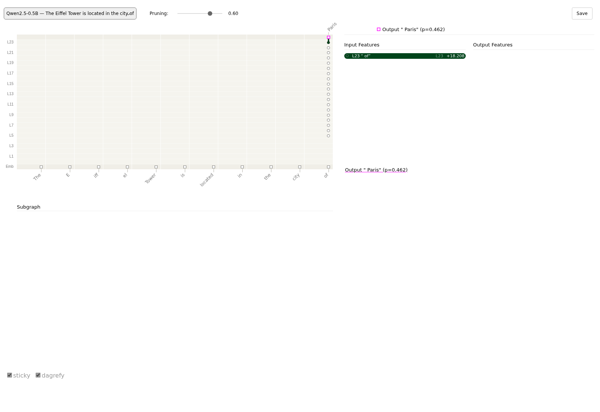

# Attribution Graph Viewers

## Attribution graphs (Neuronpedia and circuit-tracer)

An attribution graph shows how a prediction is built up through the layers of a network.
pulsatrix writes graphs in the JSON format that
[Neuronpedia's graph viewer](https://www.neuronpedia.org/graph/validator) and Anthropic's
[circuit-tracer](https://github.com/decoderesearch/circuit-tracer) read, so a large graph gets a
mature, interactive viewer with no extra code. The viewer lets you click a node to see what
feeds it and what it feeds, prune weak nodes with a slider, and pin nodes into a subgraph.

**From a language model.** `pulsatrix_explain_text --graph` explains the next-token prediction
with AttnLRP, the same as the token view, and records the relevance at every layer:

```bash
pulsatrix_explain_text MODEL_DIR "The Eiffel Tower is located in the city of" \
    --graph eiffel.json --viewer-dir graphs/
```



- **Nodes.**
  - One per token at the bottom (the embeddings).
  - One per token for the residual stream after each layer.
  - The predicted token at the top, with its probability.

  A node's activation is its relevance for the prediction.
- **Links.** A link from token *i* in one layer to token *j* in the next is the share of *j*'s
  relevance that the layer passes back to *i*. Links between different tokens are attention
  moving information; a token's own vertical path is its residual stream. The links leaving a
  node add up to that node's relevance, and the bottom row matches the token view exactly.
- **Pruning.** By default the file keeps the fewest links holding 98% of the relevance
  (`--edge-threshold`). Each node's influence lets the viewer's slider hide the least relevant
  nodes.
- **Cost.** One block pass per layer and token: about 5 seconds for an 11-token prompt on
  Qwen2.5-0.5B on a CPU. Prompts longer than 256 tokens are refused.
- **What the nodes are not.** Nodes are residual-stream positions, not interpretable features;
  this graph shows where the information flows. For a graph whose nodes are transcoder features,
  add `--transcoders DIR` ([Attribution graphs](../mechanistic-interpretability/attribution-graphs.md)).

In C++, `BuildRelevanceGraph(model, backend, ids, target, options)` (`relevance_graph.hpp`)
returns the graph, and `ToNeuronpediaJson` (`viz/attribution_graph.hpp`) writes it.

**From a circuit graph.** The ablation-scored `circuit_graph.v1` documents export too. The input
is in one column and the operations, in order, are in the next:

```bash
pulsatrix_svg circuit.json --neuronpedia --slug my-mlp --scan my-model -o my-mlp.json
```

**Viewing a graph.**

- **Locally, with circuit-tracer.** `--viewer-dir DIR` writes the graph's entry into
  `DIR/graph-metadata.json`, the index circuit-tracer's local viewer reads. Put the graph files in
  the same directory and start its server there (`circuit-tracer start-server --graph_file_dir DIR`).
  Open `http://127.0.0.1:8041/index.html?slug=SLUG`. Use `127.0.0.1` rather than `localhost`,
  because on `localhost` the viewer loads Anthropic's hosted example graphs instead.
- **On Neuronpedia.** Upload the file at
  [neuronpedia.org/graph/validator](https://www.neuronpedia.org/graph/validator). Neuronpedia
  uses `scan` as its model id.

Every file is written against Neuronpedia's `graph-schema.json`. Before writing,
`ToNeuronpediaJson` checks that node ids are unique, that links name real nodes, that numbers
are finite, and that the output node's label carries its probability, which the viewer reads.
`ParseNeuronpediaGraph` reads graphs that circuit-tracer or Neuronpedia wrote.
