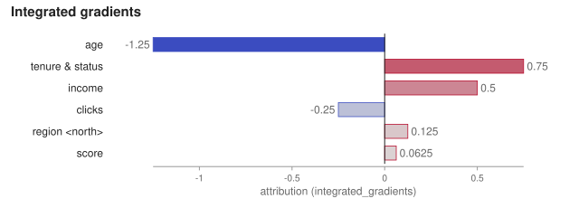
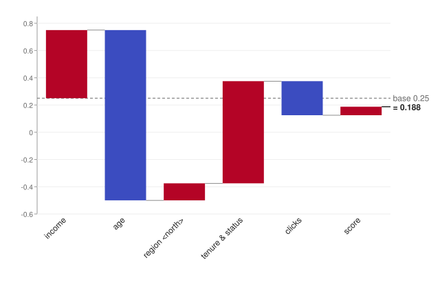
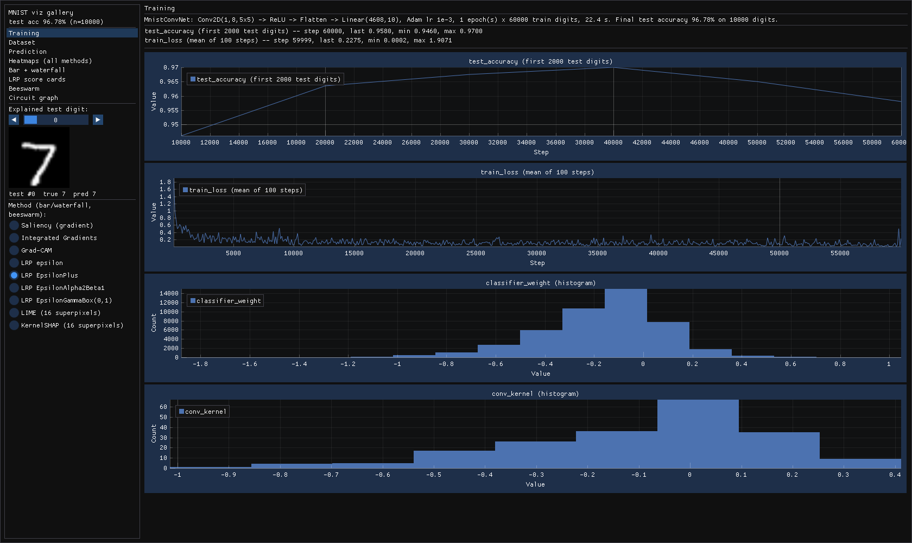
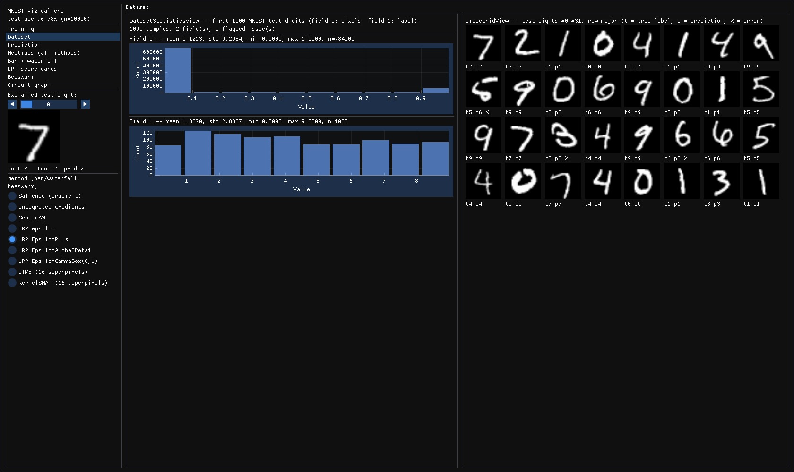
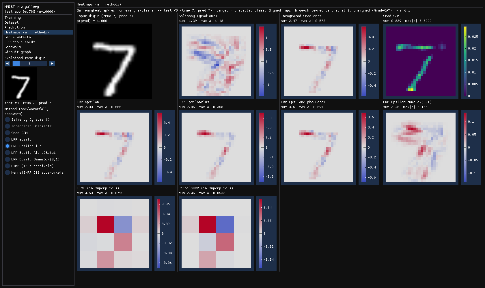
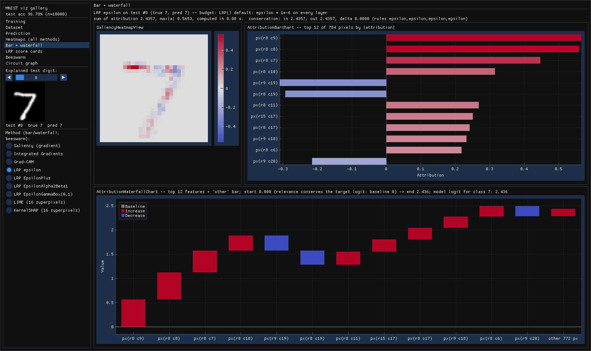
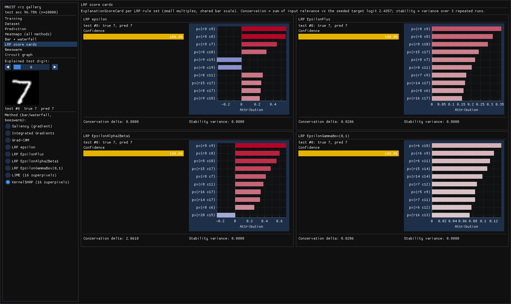
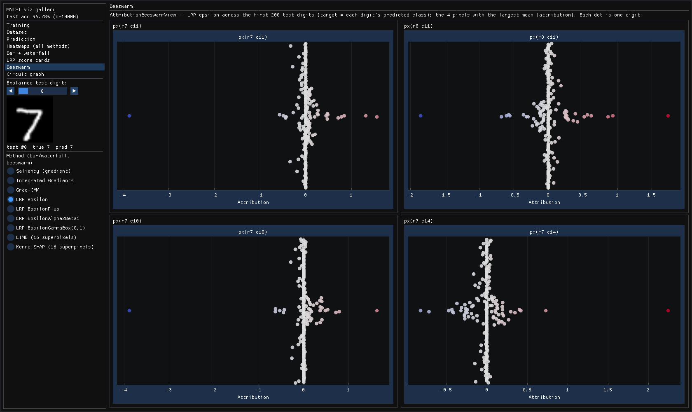
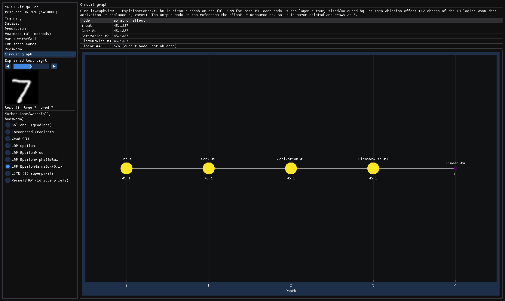

# Visualization

Use this section to see your model's explanations and training progress as charts instead of
numbers. It provides native C++ charts, dashboards, and live views built on Dear ImGui and
ImPlot (immediate-mode GUI and plotting libraries), plus versioned JSON documents and standalone
SVG figures that need no GUI at all.

The explainers, LRP rules, and interpretability tools elsewhere in pulsatrix return plain data
(`Attribution`, `CircuitGraph`, `ActivationSnapshot`) and never draw anything. This layer is
optional and sits on top of that data. `pulsatrix_core` never depends on it, the same way core
does not depend on the Python bindings (`pulsatrix_py`).

## What's inside

**Data transforms** (`viz/plot_data.hpp`, `viz/colormap.hpp`). These are plain functions with
no ImGui or ImPlot code. They are always compiled into `pulsatrix_core` and are unit-tested:

- `ToFeatureImportanceBars` / `ToWaterfallSteps` / `ToWaterfallBars`: turn an `Attribution`
  into sorted bars, or into a waterfall from the baseline to the prediction.
- `CircuitNodeDisplayLabel`: a readable label for a `CircuitGraph` node.
- `ToSaliencyHeatmap` / `ComputeHeatmapColorScale`: turn an `Attribution` into a 2D grid and
  choose its color scale. The scale is symmetric around zero when any value is negative, and
  `[0, max]` otherwise.
- `ToBeeswarmPoints`: spread one feature's values across many `Attribution`s into
  non-overlapping points. The jitter is deterministic.
- `ToFieldHistogramBins`: bin a `Dataset` field's values into an equal-width histogram.
- `ToRgbImageBuffer`: convert an image `Tensor` into bytes ready for a GPU texture.
- `ViridisColormap` / `DivergingColormap`: colorblind-safe colormaps for unsigned and signed
  values.

**Metrics sink** (`viz/implot_metrics_sink.hpp`). `ImPlotMetricsSink` is a `MetricsSink` that
stores every logged scalar and histogram as a per-tag series. Its logging methods
(`log_scalar()`, `log_histogram()`) are compiled into `pulsatrix_core` and need no flag. Only
`Draw()` needs `pulsatrix_viz`. To write your own sink, see
[Adding a new metrics sink](../customization/index.md#adding-a-new-metrics-sink).

**Chart widgets** (only with `PULSATRIX_ENABLE_VIZ=ON`). Each one is a thin ImGui/ImPlot
drawing call over the data transforms:

| Widget | Shows | Also draws |
|---|---|---|
| `AttributionBarChart` | Top features of one attribution, as bars | `AttributionDocument` |
| `AttributionWaterfallChart` | How features move the output from the baseline to the prediction | `AttributionDocument` |
| `AttributionBeeswarmView` | One feature's attribution across many inputs | — |
| `SaliencyHeatmapView` | An attribution as a 2D heatmap with a color scale | `HeatmapDocument` |
| `CircuitGraphView` | A `CircuitGraph`'s per-node ablation effect | `CircuitGraphDocument` |
| `ConfidenceMeter` | A confidence value as a labeled bar | — |
| `ExplanationScoreCard` | One panel: prediction, top features, confidence, and trust checks (`ComputeConservation`, `ComputeAttributionStability`) | — |
| `DatasetStatisticsView` | Per-field histograms of a dataset | — |
| `ImageGridView` | A grid of image thumbnails with captions | — |
| `TrainingDashboard`, `ImPlotMetricsSink::Draw()` | Live training curves | a saved `training_log.v1`, after `ReplayTrainingLog` |
| `TokenRelevanceView` | Text with each token or word colored by its relevance, with the score on hover | `TokenRelevanceDocument` |

**JSON documents** (`viz/document.hpp`, in `pulsatrix_core`). Every view's data can be saved as
a versioned JSON file and read back, so a figure can be redrawn later, by another program or by
a renderer outside pulsatrix. See [JSON documents](#json-documents).

**SVG figures** (`viz/svg.hpp`, in `pulsatrix_core`). Bar, waterfall, heatmap, token strip and
beeswarm charts as standalone SVG files, with no GPU or display. See [SVG figures](#svg-figures).

**Text explanations** (`viz/text_relevance.hpp`, in `pulsatrix_core`). These build token or word
relevance documents from a tokenizer's output, so the figure reads as the original text. The
`pulsatrix_explain_text` tool goes from a Hugging Face model and a prompt straight to a figure.
See [Token relevance for text](#token-relevance-for-text).

**Infrastructure.** `VizWindow` (`viz/window.hpp`) owns the window, the OpenGL context, and the
ImGui/ImPlot setup. You write a per-frame draw callback and call `window.run(...)`.
`TextureCache` uploads images to the GPU once and reuses them across frames.

Full API reference: [Doxygen: Visualization](../api/group__visualization.html)

## JSON documents

Interactive viewers go stale faster than file formats do, so every view reads from a versioned
JSON document. The ImGui widgets, the SVG renderer (VIZ-2) and any tool outside pulsatrix all
read the same data. The documents are part of `pulsatrix_core` and need no flag.

```cpp
#include <fstream>
#include <sstream>

#include "pulsatrix/viz/attribution_bar_chart.hpp"  // the widget needs PULSATRIX_ENABLE_VIZ
#include "pulsatrix/viz/document.hpp"

// Save an explanation...
AttributionDocument doc = ToAttributionDocument(attribution);
std::ofstream("explanation.json") << ToJson(doc);

// ...and draw it later, possibly in another program.
std::stringstream text;
text << std::ifstream("explanation.json").rdbuf();
if (VizDocumentKind(text.str()) == "attribution") {
    AttributionBarChart::Draw("Top features", ParseAttributionDocument(text.str()));
}
```

There are six kinds. Each has a struct, a writer (`ToJson`) and a reader (`Parse<Kind>Document`):

| Schema | Struct | Holds | Converts from and to |
|---|---|---|---|
| `pulsatrix.attribution.v1` | `AttributionDocument` | `method`, `shape`, row-major `values`, `metadata` | `Attribution` |
| `pulsatrix.heatmap.v1` | `HeatmapDocument` | `title`, `rows`, `cols`, `values`, optional `row_labels` and `col_labels` | `HeatmapGrid` |
| `pulsatrix.token_relevance.v1` | `TokenRelevanceDocument` | `method`, `tokens`, one `relevance` per token, `target` | — |
| `pulsatrix.circuit_graph.v1` | `CircuitGraphDocument` | `nodes` (`id`, `op_type`, `label`, `ablation_effect`) and `edges` (`from`, `to`, `weight`) | `CircuitGraph` |
| `pulsatrix.training_log.v1` | `TrainingLogDocument` | `scalars` (`tag`, `steps`, `values`) and the latest `histograms` per tag | `ImPlotMetricsSink`; `ReplayTrainingLog` logs a saved run to any `MetricsSink` |
| `pulsatrix.feature_dashboard.v1` | `FeatureDashboardDocument` | One feature's `source`, `feature_index`, `activation_density`, `max_activation`, activation histogram and `top_examples` | — |
| `pulsatrix.morris.v1` | `MorrisDocument` | `target`, `num_trajectories`, and per feature `name`, `mu`, `mu_star`, `sigma`, `mu_star_conf` | `MorrisResult` |
| `pulsatrix.sobol.v1` | `SobolDocument` | `target`, `num_samples`, and per feature `name`, `first_order`, `total_order` and their `_conf` half-widths | `SobolResult` |
| `pulsatrix.counterfactual.v1` | `CounterfactualDocument` | `target`, `valid`, `output_before`, `output_after`, and per feature its `name`, `original` and `counterfactual` value and distance `scale` | `CounterfactualResult` |
| `pulsatrix.sensitivity.v1` | `SensitivityDocument` | `target`, the unchanged `output`, and per feature its `name`, `value`, `low`, `high`, `output_low` and `output_high` | `LocalSensitivityResult` |
| `pulsatrix.partial_dependence.v1` | `PartialDependenceDocument` | `method` (`"partial_dependence"` or `"ale"`), `feature`, `target`, `grid`, `partial_dependence`, and optionally `num_instances` ICE curves (`ice`) and the instances' `feature_values` | `IceResult`, `AleResult` |

### Token relevance for text

`viz/text_relevance.hpp` builds a `token_relevance.v1` document from a real explanation, so its
pieces read as the original text:

- **`MakeTokenRelevanceDocument(text, encoding, scores, method, target)`** shows each token as the
  text its offset covers, so byte-level BPE tokens appear decoded. Tokens that split one character
  (an emoji's bytes) become one piece with their scores summed. Text no token covers becomes
  unscored context. BOS and other inserted tokens appear as their token strings, or go to
  `unassigned` when left out.
- **`MakeWordRelevanceDocument(text, word_scores, method, target)`** takes the output of
  `AggregateToWords` (TOK-4): each word is scored, and the spaces between words are unscored
  context.

The document grows three optional fields, all backward compatible, each written only when it
says something:
- `granularity` (`"token"` or `"word"`)
- `scored` (one flag per piece; unscored pieces are context)
- `unassigned` (relevance that belongs to no piece shown)

The SVG token strip draws context as plain text, and so does the `TokenRelevanceView` ImGui
widget (`viz/token_relevance_view.hpp`).

`pulsatrix_explain_text` does all of this for a Hugging Face model in one step. It tokenizes,
runs AttnLRP from the most likely next token, and writes the figure or document:

```sh
pulsatrix_explain_text models/SmolLM2-135M "The Eiffel Tower is located in the city of" -o paris.svg
pulsatrix_explain_text models/SmolLM2-135M "The Eiffel Tower is located in the city of" --words -o paris.json
token_relevance_demo paris.json   # the ImGui widget (PULSATRIX_ENABLE_VIZ)
```

For " Paris", the word view gives "Eiffel" +4.09, and every other word stays under 1.6 in
magnitude ("The" is −1.60). The token view shows the relevance sits on "iffel"; "E" gets little.

The widgets read documents directly: `AttributionBarChart`, `AttributionWaterfallChart`,
`SaliencyHeatmapView` and `CircuitGraphView` each have a `Draw` overload for their document. For
the training dashboard, replay the log into an `ImPlotMetricsSink` once and draw that.

An attribution document looks like this:

```json
{
  "schema": "pulsatrix.attribution.v1",
  "method": "integrated_gradients",
  "shape": [2, 3],
  "values": [0.5, -1.25, 0, 3, 0.1, -0.001],
  "metadata": {
    "baseline": "zero",
    "steps": "50"
  }
}
```

Examples of every kind are in
[`tests/fixtures/viz/`](https://github.com/Joshuaweg/pulsatrix/tree/master/tests/fixtures/viz).
Tests check that the writer reproduces each one byte for byte.

### Format rules

- **Schema and version.** Every document is an object whose `"schema"` is
  `pulsatrix.<kind>.v<N>`. `VizDocumentKind()` returns the kind, so a viewer can pick the
  reader. A reader accepts only its own major version.
- **Compatibility within a version.** Version 1 only ever gains fields, and readers ignore
  fields they don't know, so an older reader can read a newer v1 file. Removing, renaming or
  changing the meaning of a field means v2.
- **NaN and infinity.** JSON has no literal for them. A non-finite number is written as `null`,
  and the top-level `"nonfinite"` object maps its
  [JSON Pointer](https://www.rfc-editor.org/rfc/rfc6901) to `"nan"`, `"inf"` or `"-inf"`:

    ```json
    "values": [1, null],
    "nonfinite": {
      "/values/1": "nan"
    }
    ```

    The member appears only when the document has a non-finite number. A reader rejects a
    `null` number with no entry, and an entry that doesn't point at a `null` number, so no value
    is ever silently lost.
- **Numbers round-trip exactly.** Each number is written with the shortest text that reads back
  as the same `float` (or `double`, for training-log values), formatted the way JavaScript
  prints numbers. Reading the file gives back the same bits.
- **Deterministic output.** The same document always gives the same bytes on every platform:
  fixed member order, metadata sorted by key, two-space indent, and number arrays on one line.
- **Strict reading.** The parser follows RFC 8259 strictly. It rejects comments, trailing
  commas, duplicate keys, invalid UTF-8 and nesting deeper than 256 levels. Every reader error
  names the JSON Pointer of the problem, for example
  `pulsatrix.heatmap.v1 document: /row_labels: needs one label per row, or none`.
- **Text is UTF-8.** Token strings must be valid UTF-8, so decode byte-level BPE tokens before
  writing them.

The parser is fuzzed (`tools/fuzz/viz_document_fuzz.cpp`). `pulsatrix/json.hpp` exposes the
underlying `JsonValue`, `ParseJson` and `WriteJson` for other uses.

## SVG figures

For papers, reports and CI, `viz/svg.hpp` draws documents as standalone SVG files. It needs no
GPU, display, font library or ImGui, and it is part of `pulsatrix_core`. Colors come from
`colormap.hpp`, the same as the ImGui widgets: blue-white-red for signed values and Viridis for
magnitudes.

| Function | Draws | From |
|---|---|---|
| `RenderBarChartSvg(doc, top_k)` | The top features by \|attribution\|, on an axis through zero | `AttributionDocument` |
| `RenderWaterfallSvg(doc, baseline)` | Each feature moving the output from the baseline to the prediction | `AttributionDocument` |
| `RenderHeatmapSvg(doc)` | The grid, with a color bar and any row and column labels | `HeatmapDocument` |
| `RenderTokenStripSvg(doc)` | The text's tokens, wrapped, each on a background colored by its relevance | `TokenRelevanceDocument` |
| `RenderBeeswarmSvg(docs, features)` | One row per feature, one point per input | several `AttributionDocument`s |
| `RenderCounterfactualSetSvg(docs)` | Several counterfactuals of one input side by side: a column each, a row per changed feature, cells colored by the change | several `CounterfactualDocument`s |
| `RenderMorrisSvg(doc)` | μ* against σ on one scale, a point per feature with μ*'s interval, and the line σ = μ* | `MorrisDocument` |
| `RenderSobolSvg(doc, top_k)` | First- and total-order indices per feature, largest total first, with confidence whiskers | `SobolDocument` |
| `RenderCounterfactualSvg(doc, max_rows)` | Whether the target is reached, then each changed feature, costliest first, with its old and new value and its change in units of its scale | `CounterfactualDocument` |
| `RenderTornadoSvg(doc, top_k)` | One row per feature, largest swing first: bars from the unchanged output to the output at the feature's low and high values | `SensitivityDocument` |
| `RenderPartialDependenceSvg(doc, view)` | ICE curves under their average, raw, centered or as slopes, with a rug of the inputs' values | `PartialDependenceDocument` |

```cpp
#include <fstream>

#include "pulsatrix/viz/svg.hpp"

SvgOptions options;
options.title = "Why the model said yes";
std::ofstream("bars.svg") << RenderBarChartSvg(ToAttributionDocument(attribution), 10, options);
```





`SvgOptions` sets the width (default 640 pixels), a title and the font size. The height follows
from the content. Every figure has a title element for screen readers, and every bar, cell and
token has a tooltip with its exact value.

**From the command line.** The `pulsatrix_svg` tool, built and installed with the library,
turns documents into figures:

```bash
pulsatrix_svg explanation.json -o bars.svg                 # attribution: bar chart
pulsatrix_svg explanation.json --waterfall 0.12 -o wf.svg  # attribution: waterfall
pulsatrix_svg run*.json --beeswarm 0,3,7 -o swarm.svg      # many attributions: beeswarm
pulsatrix_svg saliency.json -o map.svg                     # heatmap
pulsatrix_svg tokens.json -o text.svg                      # token relevance
pulsatrix_svg pd.json --ice centered -o ice.svg            # partial dependence, centered ICE
pulsatrix_svg sens.json --top-k 8 -o tornado.svg           # sensitivity: tornado chart
pulsatrix_svg cf.json -o cf.svg                            # counterfactual: what changed
pulsatrix_svg cf1.json cf2.json cf3.json -o set.svg        # several counterfactuals side by side
pulsatrix_svg morris.json -o morris.svg                    # Morris screening scatter
pulsatrix_svg sobol.json -o sobol.svg                      # Sobol index bars
```

Other options: `--top-k N`, `--width W`, `--font-size N`, `--title TEXT`.

**Details:**

- **Deterministic.** The same input gives the same bytes on every platform. Tests compare each
  chart with a stored file.
- **Large heatmaps.** Grids up to 4,096 cells are one vector rectangle per cell. Larger grids,
  such as a 224 x 224 saliency map, are embedded as a lossless PNG with sharp pixel edges, which
  keeps the file small (about 45 KB for 224 x 224).
- **Non-finite values.** A heatmap cell or token whose value is NaN or infinite is drawn gray and
  left out of the color scale. The bar, waterfall and beeswarm charts refuse non-finite values,
  because there's no honest bar length for them.
- **Text widths are estimated** at 0.6 em per character, since there is no font library. Token
  strips use a monospace font, so their widths are exact. Long labels are shortened with an
  ellipsis.

## Building with visualization enabled

### Prerequisites

The default build has no GUI dependencies. `-DPULSATRIX_ENABLE_VIZ=ON` adds these:

- **Network access at configure time.** CMake downloads GLFW 3.4, Dear ImGui v1.92.5, and
  ImPlot v0.17 with `FetchContent`.
- **OpenGL development files.** CMake runs `find_package(OpenGL REQUIRED)`. On Debian/Ubuntu,
  install `libgl1-mesa-dev`.
- **GLFW's build dependencies on Linux.** GLFW 3.4 builds X11 and Wayland support by default.
  On Debian/Ubuntu, install `libx11-dev libxrandr-dev libxinerama-dev libxcursor-dev libxi-dev`
  for X11, and `libwayland-dev libxkbcommon-dev wayland-protocols` for Wayland. To skip
  Wayland, add `-DGLFW_BUILD_WAYLAND=OFF`.
- **A display and a GPU driver** to run anything that links `pulsatrix_viz`. That is why
  the option defaults to `OFF` and CI builds without it.
- **Optional: FreeType and fontconfig**, for text in every language (see
  [Fonts and languages](#fonts-and-languages)). On Debian/Ubuntu, install
  `libfreetype-dev libfontconfig1-dev`. CMake uses them when it finds them. Without them the
  windows still work, using stb_truetype and a list of common font files.

### Fonts and languages

The windows show text in any language your system has fonts for: Chinese, Japanese, Korean,
Cyrillic, Greek, Arabic, Hebrew, Indic scripts, Thai, Georgian, Armenian, Ethiopic, math symbols,
emoji and more. A `VizWindow` starts from Dear ImGui's default font and merges system fonts in
behind it, so the default look doesn't change. A fallback font is used only for characters the
fonts before it lack, and each glyph is drawn the first time it's needed.

How the fonts are found:

- **Linux with fontconfig**: about forty sample characters, one per script plus symbols, math
  and emoji, are each matched to the best installed font. That's typically 20 to 30 fonts, and it
  adds about 0.1 s and 30 MB at startup.
- **Windows and macOS**: the fonts that ship with the system (Segoe UI, Microsoft YaHei, Nirmala
  UI, Segoe UI Emoji, ...; Helvetica, PingFang, Arial Unicode, ...).
- **Linux without fontconfig**: common Noto and DejaVu files in the usual font directories.

To choose fonts yourself, set `PULSATRIX_VIZ_FONTS` to font files, separated by `:` (`;` on
Windows). They come first, before the system fonts. Set it to `none` to use only ImGui's default
font. In code, pass a `VizFontOptions` to the `VizWindow` constructor:

```cpp
VizFontOptions fonts;
fonts.fonts = {{"/path/to/MyFont.ttf"}};  // first in line, before the system fonts
fonts.size = 18.0f;                      // pixels; ImGui's default is 13
VizWindow window("my app", 1280, 800, fonts);
```

**Emoji.** Emoji are drawn in color with a vector color font, such as Segoe UI Emoji (Windows)
or Twemoji, when FreeType is available. Bitmap emoji fonts can't be scaled, so they are skipped.
That covers Noto Color Emoji (the usual one on Linux) and Apple Color Emoji. On Linux, install
a vector emoji font for color (for example Twemoji, from `mozilla/twemoji-colr`) and point
`PULSATRIX_VIZ_FONTS` at it. Without one, emoji fall back to black-and-white glyphs where a text
font has them.

**Scripts that need text shaping.** Dear ImGui places characters one after another. It can't join
Arabic letters, lay out right-to-left text, or reorder and combine the vowel signs and conjuncts
of Indic scripts, and a ligature such as an emoji with a skin tone shows as two glyphs. For these
scripts every character appears, but not as a reader would write them. The SVG figures don't have
this limit: the browser or SVG viewer shapes the text. `TokenRelevanceView` is fine for reading
scores, and the SVG strip (`pulsatrix_explain_text ... -o out.svg`) shows the text itself
correctly.

### Build

```bash
cmake -S . -B build -DPULSATRIX_ENABLE_VIZ=ON
cmake --build build --target training_dashboard_demo --config Release
```

Link your own executable against `pulsatrix_viz`. It brings in `pulsatrix_core`, `imgui`, and
`implot`, including their include directories:

```cmake
add_executable(my_viz_app my_viz_app.cpp)
target_link_libraries(my_viz_app PRIVATE pulsatrix_viz)
```

`pulsatrix_viz` isn't installed, so use it from a source tree (`add_subdirectory`). An installed
`find_package(pulsatrix)` gives you `pulsatrix::core`, which includes the JSON documents and the
SVG renderer.

The data transforms, `ImPlotMetricsSink`'s logging methods, the JSON documents and the SVG
renderer need no flag. They are always
part of `pulsatrix_core`.

### Demo apps

| Target | What it shows |
|---|---|
| `training_dashboard_demo` | Live loss curves while an XOR network trains |
| `explanation_dashboard_demo` | Bar chart, waterfall, saliency heatmap, circuit graph, and score card for a small XOR network |
| `dataset_preview_demo` | `DatasetStatisticsView` and `ImageGridView` on small synthetic datasets |
| `live_inference_demo` | An `ExplanationScoreCard` that updates as it cycles through XOR inputs |
| `token_relevance_demo` | `TokenRelevanceView` on token relevance documents, for example from `pulsatrix_explain_text` |
| `mnist_viz_gallery` | Every widget on MNIST digits (see [below](#mnist-gallery)) |

## How to implement

### A live training dashboard

```cpp
#include <imgui.h>

#include "pulsatrix/adam_optimizer.hpp"
#include "pulsatrix/cpu_backend.hpp"
#include "pulsatrix/viz/training_dashboard.hpp"
#include "pulsatrix/viz/window.hpp"
#include "pulsatrix/xor_training_example.hpp"

using namespace pulsatrix;

CPUBackend backend;
XorNetwork net(&backend);
AdamOptimizer optimizer(0.05f, &backend);
ImPlotMetricsSink sink;  // a MetricsSink that buffers logged values for plotting

// The four XOR examples, as (1, 2) inputs and (1, 1) targets.
const float xs[4][2] = {{0, 0}, {0, 1}, {1, 0}, {1, 1}};
const float ys[4] = {0, 1, 1, 0};
int step = 0;

VizWindow window("Training Dashboard", 1000, 700);
window.run([&]() {
    for (int i = 0; i < 4 && step < 4000; ++i, ++step) {   // a few training steps per frame
        Tensor input(Shape({1, 2}), &backend, {xs[step % 4][0], xs[step % 4][1]});
        Tensor target(Shape({1, 1}), &backend, {ys[step % 4]});
        net.train_step(input, target, optimizer, sink, step);  // logs the loss to sink
    }
    ImGui::Begin("Training Dashboard");
    TrainingDashboard::Draw(sink);
    ImGui::End();
});
```

Full source: [`examples/viz/training_dashboard_demo.cpp`](https://github.com/Joshuaweg/pulsatrix/blob/master/examples/viz/training_dashboard_demo.cpp).

**What's happening:** `XorNetwork::train_step()` and `MnistConvNet::train_step()` take a
`MetricsSink&`. Passing an `ImPlotMetricsSink` adds plotting with no change to the training
code. Each frame, `TrainingDashboard::Draw()` reads the sink's per-tag series. It draws a
one-line summary per tag (last, min, max, current step) and a small line chart for each tag.

Logging and drawing are separate methods. The logging half works, and is unit-tested, even
with `PULSATRIX_ENABLE_VIZ=OFF`. Only `Draw()` needs the GUI stack.

Recipe: [Training dashboard](../recipes/visualization/training_dashboard.md).

## MNIST gallery

`mnist_viz_gallery` runs every widget on this page against MNIST test digits:

```bash
python3 tools/fetch_mnist.py              # once: data/MNIST/raw/ (gitignored)
cmake -S . -B build-viz -DPULSATRIX_ENABLE_VIZ=ON -DCMAKE_BUILD_TYPE=Release
cmake --build build-viz --target mnist_viz_gallery -j
./build-viz/mnist_viz_gallery                          # interactive
./build-viz/mnist_viz_gallery --screenshot out/        # one PNG per page, then exit
```

Run it from the repository root, or pass `--data DIR` (default `data/MNIST/raw`).

| Option | Meaning | Default |
|---|---|---|
| `--epochs N` | Training epochs | 1 |
| `--train N` | Training digits (about 25 s per epoch on one CPU core at the default) | 60000 |
| `--images N` | Test digits explained with every method. If none is misclassified, the first misclassified test digit is added. | 4 |
| `--eval N` | Held-out digits for the accuracy curve | 2000 |
| `--beeswarm N` | Digits behind each beeswarm | 200 |
| `--screenshot DIR` | Save one PNG per page to `DIR`, then exit | off |

| Page | Widgets | What it shows |
|---|---|---|
| Training | `ImPlotMetricsSink`, `TrainingDashboard` | `MnistConvNet` (Conv2D(1,8,5x5) -> ReLU -> Flatten -> Linear) training live: 100-step mean loss, held-out accuracy, final conv-kernel and classifier-weight histograms |
| Dataset | `DatasetStatisticsView`, `ImageGridView`, `TextureCache` | Pixel and label histograms of the first 1000 test digits; 32 test digits captioned with true and predicted label |
| Prediction | `ConfidenceMeter` | 10-class softmax of the selected digit |
| Heatmaps | `SaliencyHeatmapView` | Saliency, IG, Grad-CAM, LRP epsilon / EpsilonPlus / EpsilonAlpha2Beta1 / EpsilonGammaBox(0,1), LIME, KernelSHAP side by side |
| Bar + waterfall | `AttributionBarChart`, `AttributionWaterfallChart` | Top-12 features of the selected method, starting from its reference value (black-image logit for IG/SHAP, 0 otherwise) |
| LRP score cards | `ExplanationScoreCard` | One card per LRP rule set, on a shared scale: confidence, top relevance, conservation delta, stability over repeated runs |
| Beeswarm | `AttributionBeeswarmView` | The 4 pixels with the highest mean \|attribution\| across 200 test digits, per gradient/LRP method |
| Circuit graph | `CircuitGraphView` | `ExplainerContext::build_circuit_graph` on the CNN: per-layer zero-ablation effect |

For what the LRP rule names mean, see [LRP](../interpretability/lrp.md).

### Explainer settings

| Method | Setting |
|---|---|
| Integrated Gradients | 128 steps from a black baseline |
| Grad-CAM | The 24x24 map is zero-padded by 2 px onto the 28x28 grid, so each cell sits at the center of its 5x5 receptive field |
| KernelSHAP | 16 superpixels (a 4x4 grid of 7x7 patches); all 2^16 coalitions enumerated exactly; an absent patch is black |
| LIME | The same 16 superpixels; 2000 samples; sigma 0.5 |

!!! note "Why LIME uses superpixels"
    This library's LIME sets its locality kernel width equal to the perturbation sigma. On all
    784 pixels, every sample weight underflows to zero, so pixel-level LIME is not meaningful
    here.

The gallery prints the test accuracy to stdout. For each explainer it also prints the
attribution sum, the max |attribution|, and the IG-completeness, SHAP-efficiency, or
LRP-conservation check.

Signed attributions use the blue-white-red diverging map, centered on zero. Unsigned ones
(Grad-CAM) use Viridis. `SaliencyHeatmapView` picks the map via `ComputeHeatmapColorScale`.

### Screenshots

Captured with `--screenshot` on a model trained for one epoch (96.78% test accuracy), test
digit #0 (a 7):

| | |
|---|---|
|  |  |
| Training: live loss, held-out accuracy, weight histograms | Dataset: pixel/label histograms, captioned test digits (X = misclassified) |
|  |  |
| Heatmaps: all nine explainers side by side | LRP epsilon: heatmap, top-12 bars, waterfall to the 2.436 logit |
|  |  |
| Score cards: one per LRP rule set, conservation and stability | Beeswarm: top-4 pixels across 200 test digits |
|  | |
| Circuit graph: per-layer zero-ablation effect (the output node is the reference, not ablated) | |

## Recipes

- [Training dashboard](../recipes/visualization/training_dashboard.md)
